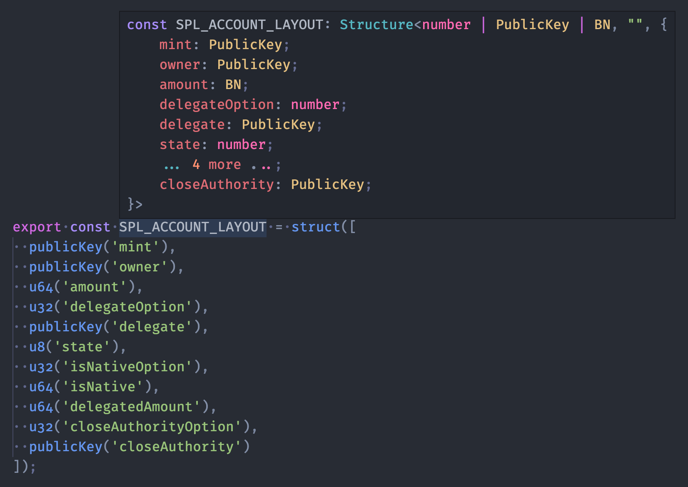
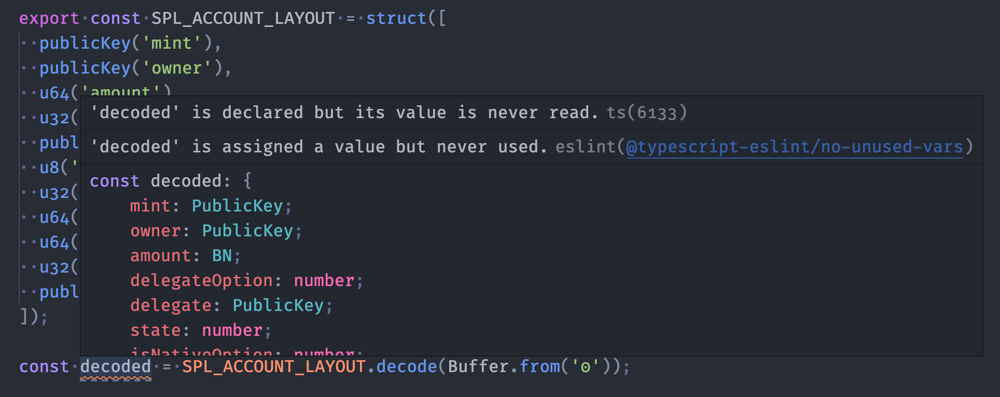

# Raydium SDK

[npm-image]: https://img.shields.io/npm/v/@raydium-io/raydium-sdk.svg?style=flat
[npm-url]: https://www.npmjs.com/package/@raydium-io/raydium-sdk

[![npm][npm-image]][npm-url]

An SDK for building applications on top of Raydium.

## Installation

### Yarn

```bash
$ yarn add @raydium-io/raydium-sdk
```

### npm

```bash
$ npm install @raydium-io/raydium-sdk --save
```

## Hosting JSON files

### Tokens List

- Solana format: https://api.raydium.io/v2/sdk/token/solana.mainnet.json
- Raydium format: https://api.raydium.io/v2/sdk/token/raydium.mainnet.json

### Token Icons

- /icons/{mint}.png

### Liquidity Pools List

**_Includes all pubkeys that build transaction need_**

- https://api.raydium.io/v2/sdk/liquidity/mainnet.json

#### Example of parse pool info

```typescript
import { Connection, PublicKey } from "@solana/web3.js";
import { TOKEN_PROGRAM_ID } from "@solana/spl-token";
import {
  TokenAccount,
  SPL_ACCOUNT_LAYOUT,
  LIQUIDITY_STATE_LAYOUT_V4,
} from "@raydium-io/raydium-sdk";
import { OpenOrders } from "@project-serum/serum";
import BN from "bn.js";

async function getTokenAccounts(connection: Connection, owner: PublicKey) {
  const tokenResp = await connection.getTokenAccountsByOwner(owner, {
    programId: TOKEN_PROGRAM_ID,
  });

  const accounts: TokenAccount[] = [];
  for (const { pubkey, account } of tokenResp.value) {
    accounts.push({
      pubkey,
      accountInfo: SPL_ACCOUNT_LAYOUT.decode(account.data),
    });
  }

  return accounts;
}

// raydium pool id can get from api: https://api.raydium.io/v2/sdk/liquidity/mainnet.json
const SOL_USDC_POOL_ID = "58oQChx4yWmvKdwLLZzBi4ChoCc2fqCUWBkwMihLYQo2";
const OPENBOOK_PROGRAM_ID = new PublicKey(
  "srmqPvymJeFKQ4zGQed1GFppgkRHL9kaELCbyksJtPX"
);

export async function parsePoolInfo() {
  const connection = new Connection({mainnet rpc node}, "confirmed");
  const owner = new PublicKey("VnxDzsZ7chE88e9rB6UKztCt2HUwrkgCTx8WieWf5mM");

  const tokenAccounts = await getTokenAccounts(connection, owner);

  // example to get pool info
  const info = await connection.getAccountInfo(new PublicKey(SOL_USDC_POOL_ID));
  if (!info) return;

  const poolState = LIQUIDITY_STATE_LAYOUT_V4.decode(info.data);
  const openOrders = await OpenOrders.load(
    connection,
    poolState.openOrders,
    OPENBOOK_PROGRAM_ID // OPENBOOK_PROGRAM_ID(marketProgramId) of each pool can get from api: https://api.raydium.io/v2/sdk/liquidity/mainnet.json
  );

  const baseDecimal = 10 ** poolState.baseDecimal.toNumber(); // e.g. 10 ^ 6
  const quoteDecimal = 10 ** poolState.quoteDecimal.toNumber();

  const baseTokenAmount = await connection.getTokenAccountBalance(
    poolState.baseVault
  );
  const quoteTokenAmount = await connection.getTokenAccountBalance(
    poolState.quoteVault
  );

  const basePnl = poolState.baseNeedTakePnl.toNumber() / baseDecimal;
  const quotePnl = poolState.quoteNeedTakePnl.toNumber() / quoteDecimal;

  const openOrdersBaseTokenTotal =
    openOrders.baseTokenTotal.toNumber() / baseDecimal;
  const openOrdersQuoteTokenTotal =
    openOrders.quoteTokenTotal.toNumber() / quoteDecimal;

  const base =
    (baseTokenAmount.value?.uiAmount || 0) + openOrdersBaseTokenTotal - basePnl;
  const quote =
    (quoteTokenAmount.value?.uiAmount || 0) +
    openOrdersQuoteTokenTotal -
    quotePnl;

  const denominator = new BN(10).pow(poolState.baseDecimal);

  const addedLpAccount = tokenAccounts.find((a) =>
    a.accountInfo.mint.equals(poolState.lpMint)
  );

  console.log(
    "SOL_USDC pool info:",
    "pool total base " + base,
    "pool total quote " + quote,

    "base vault balance " + baseTokenAmount.value.uiAmount,
    "quote vault balance " + quoteTokenAmount.value.uiAmount,

    "base tokens in openorders " + openOrdersBaseTokenTotal,
    "quote tokens in openorders  " + openOrdersQuoteTokenTotal,

    "base token decimals " + poolState.baseDecimal.toNumber(),
    "quote token decimals " + poolState.quoteDecimal.toNumber(),
    "total lp " + poolState.lpReserve.div(denominator).toString(),

    "addedLpAmount " +
      (addedLpAccount?.accountInfo.amount.toNumber() || 0) / baseDecimal
  );
}

parsePoolInfo();
```

### Farm/Staking Pools List

**_Includes all pubkeys that build transaction need_**

- https://api.raydium.io/v2/sdk/farm/mainnet.json

#### Example of parse farm info

```typescript
import { Connection, PublicKey } from "@solana/web3.js";
import { Farm } from "@raydium-io/raydium-sdk";
import {
  JsonPairItemInfo,
  FarmPoolsJsonFile,
  FarmPoolJsonInfo,
  TokenInfo,
} from "./types";
import axios from "axios";
import Decimal from "decimal.js";

// raydium farm id can get from api: https://api.raydium.io/v2/sdk/farm-v2/mainnet.json
const SOL_USDC_FARM_ID = "GUzaohfNuFbBqQTnPgPSNciv3aUvriXYjQduRE3ZkqFw";

export async function demoFarm() {
  const connection = new Connection({mainnet rpc node}, "confirmed");
  const owner = new PublicKey("VnxDzsZ7chE88e9rB6UKztCt2HUwrkgCTx8WieWf5mM");

  console.log("fetching farms");
  const { data: farmData } = await axios.get<FarmPoolsJsonFile>(
    "https://api.raydium.io/v2/sdk/farm-v2/mainnet.json"
  );

  console.log("fetching pairs");
  const { data: pairData } = await axios.get<JsonPairItemInfo[]>(
    "https://api.raydium.io/v2/main/pairs"
  );

  const pairApr = Object.fromEntries(
    pairData.map((i) => [
      i.ammId,
      { apr30d: i.apr30d, apr7d: i.apr7d, apr24h: i.apr24h },
    ])
  );

  console.log("fetching liquidity");
  const { data: liquidityData } = await axios.get<{
    official: any[];
    unOfficial: any[];
  }>("https://api.raydium.io/v2/sdk/liquidity/mainnet.json");

  const allLiquidity = [...liquidityData.official, ...liquidityData.unOfficial];

  console.log("fetching token data");
  const { data: tokenData } = await axios.get<{
    official: TokenInfo[];
    unOfficial: TokenInfo[];
  }>("https://api.raydium.io/v2/sdk/token/raydium.mainnet.json");

  const allToken: Map<string, TokenInfo> = [
    ...tokenData.official,
    ...tokenData.unOfficial,
  ].reduce((acc, cur) => {
    acc.set(cur.mint, cur);
    return acc;
  }, new Map());

  console.log("fetching token prices");
  const { data: tokenPrices } = await axios.get<{ [key: string]: number }>(
    "https://api.raydium.io/v2/main/price"
  );

  console.log("fetching chain time");
  const { data: chainTimeData } = await axios.get<{
    chainTime: number;
    offset: number;
  }>("https://api.raydium.io/v2/sdk/token/raydium.mainnet.json");

  const currentBlockChainDate =
    chainTimeData.chainTime * 1000 + chainTimeData.offset * 1000;

  const allFarms: FarmPoolJsonInfo[] = Object.keys(farmData).reduce(
    // @ts-ignore
    (acc, cur) => [...acc.concat(farmData[cur])],
    []
  );

  const farmInfo = allFarms.find((farm) => farm.id === SOL_USDC_FARM_ID)!;
  const pairInfo = pairData.find((p) => p.lpMint === farmInfo.lpMint)!;
  const liquidityInfo = allLiquidity.find((p) => p.lpMint === farmInfo.lpMint)!;

  const farmInfoWithKeys = {
    ...farmInfo,
    id: new PublicKey(farmInfo.id),
    programId: new PublicKey(farmInfo.programId),
    baseMint: new PublicKey(farmInfo.baseMint),
    quoteMint: new PublicKey(farmInfo.quoteMint),
    lpMint: new PublicKey(farmInfo.lpMint),
    authority: new PublicKey(farmInfo.authority),
    lpVault: new PublicKey(farmInfo.lpVault),
    rewardInfos: farmInfo.rewardInfos.map((r) => ({
      ...r,
      rewardMint: new PublicKey(r.rewardMint),
      rewardVault: new PublicKey(r.rewardVault),
    })),
  };

  console.log("decode farm data");
  const parsedFarmInfo = (
    await Farm.fetchMultipleInfoAndUpdate({
      connection,
      pools: [farmInfoWithKeys],
      owner,
      config: { commitment: "confirmed" },
    })
  )[SOL_USDC_FARM_ID];

  const tvl = new Decimal(parsedFarmInfo.lpVault.amount.toString())
    .div(10 ** liquidityInfo.lpDecimals)
    .mul(pairInfo.lpPrice || 0);

  const samples = await connection.getRecentPerformanceSamples(4);
  const slotList = samples.map((item) => item.numSlots);
  const blockSlotCountForSecond =
    slotList.reduce((a, b) => a + b, 0) / slotList.length / 60;

  const rewardsApr = parsedFarmInfo.state.rewardInfos.map((r: any, idx) => {
    if (farmInfo.version === 6) {
      const { rewardPerSecond, rewardOpenTime, rewardEndTime, rewardMint } = r;
      const isRewardBeforeStart =
        rewardOpenTime.toNumber() * 1000 < currentBlockChainDate;
      const isRewardAfterEnd =
        rewardEndTime.toNumber() * 1000 > currentBlockChainDate;
      if (isRewardBeforeStart || isRewardAfterEnd) return 0;

      if (!rewardMint) return 0;
      const rewardPrice = tokenPrices[rewardMint.toString()] || 0;
      if (!rewardPrice) return 0;
      const rewardToken = allToken.get(rewardMint.toString())!;
      if (!rewardToken) return 0;

      const reward = new Decimal(rewardPerSecond.toString())
        .div(10 ** rewardToken.decimals)
        .mul(60 * 60 * 24 * 365)
        .mul(rewardPrice);

      const tvl = new Decimal(parsedFarmInfo.lpVault.amount.toString())
        .div(10 ** liquidityInfo.lpDecimals)
        .mul(pairInfo.lpPrice || 0);

      const apr = reward.div(tvl);

      return apr.toNumber();
    }

    const rewardMint = farmInfo.rewardInfos[idx].rewardMint;
    const rewardPrice = tokenPrices[rewardMint] || 0;
    const rewardToken = allToken.get(rewardMint)!;
    const reward = new Decimal(r.perSlotReward.toString())
      .div(10 ** rewardToken.decimals)
      .mul(blockSlotCountForSecond * 60 * 60 * 24 * 365)
      .mul(rewardPrice);

    const apr = reward.div(tvl);

    return apr.toNumber();
  });

  const totalApr24h = new Decimal(rewardsApr.reduce((acc, cur) => acc + cur, 0))
    .mul(100)
    .add(pairApr[liquidityInfo.id].apr24h);

  const userDeposited = new Decimal(
    parsedFarmInfo.ledger?.deposited.toString() || 0
  ).div(10 ** liquidityInfo.lpDecimals);

  console.log({
    userDeposited: userDeposited.toString(),
    tvl: tvl.toString(),
    totalApr24h: totalApr24h.toString(),
    rewards: rewardsApr
      .filter((apr) => apr > 0)
      .map((apr, idx) => ({
        apr: apr * 100 + "%",
        rewardToken: allToken.get(
          farmInfo.rewardInfos[idx].rewardMint ||
            // @ts-ignore
            parsedFarmInfo.state.rewardInfos[idx].rewardMint.toString()
        )!.symbol,
      })),
  });
}

demoFarm();
```

##### types
```typescript
export interface JsonPairItemInfo {
  ammId: string;
  apr24h: number;
  apr7d: number;
  apr30d: number;
  fee7d: number;
  fee7dQuote: number;
  fee24h: number;
  fee24hQuote: number;
  fee30d: number;
  fee30dQuote: number;
  liquidity: number;
  lpMint: string;
  lpPrice: number | null;
  market: string;
  name: string;
  official: boolean;
  price: number;
  tokenAmountCoin: number;
  tokenAmountLp: number;
  tokenAmountPc: number;
  volume7d: number;
  volume7dQuote: number;
  volume24h: number;
  volume24hQuote: number;
  volume30d: number;
  volume30dQuote: number;
}

export interface APIRewardInfo {
  rewardMint: string;
  rewardVault: string;
  rewardOpenTime: number;
  rewardEndTime: number;
  rewardPerSecond: string | number;
  rewardSender?: string;
  rewardType: "Standard SPL" | "Option tokens";
}

export interface FarmPoolJsonInfo {
  id: string;
  lpMint: string;
  lpVault: string;

  baseMint: string;
  quoteMint: string;
  name: string;

  version: number;
  programId: string;

  authority: string;
  creator?: string;
  rewardInfos: APIRewardInfo[];
  upcoming: boolean;

  rewardPeriodMin?: number; // v6 '7-90 days's     7 * 24 * 60 * 60 seconds
  rewardPeriodMax?: number; // v6 '7-90 days's     90 * 24 * 60 * 60 seconds
  rewardPeriodExtend?: number; // v6 'end before 72h's    72 * 60 * 60 seconds

  local: boolean; // only if it is in localstorage(create just by user)
  category: "stake" | "raydium" | "fusion" | "ecosystem"; // add by UI for unify the interface
}

export type FarmPoolsJsonFile = {
  name: string;
  version: unknown;
  stake: Omit<FarmPoolJsonInfo, "category">[];
  raydium: Omit<FarmPoolJsonInfo, "category">[];
  fusion: Omit<FarmPoolJsonInfo, "category">[];
  ecosystem: Omit<FarmPoolJsonInfo, "category">[];
};

export interface TokenInfo {
  symbol: string;
  name: string;
  mint: string;
  decimals: number;
  extensions: {
    coingeckoId?: string;
  };
  icon: string;
  hasFreeze: number;
}
```

## Program IDs

| Function        | Version | Mainnet                                      |
| --------------- | ------- | -------------------------------------------- |
| AMM / Liquidity | 4       | 675kPX9MHTjS2zt1qfr1NYHuzeLXfQM9H24wFSUt1Mp8 |
| Farm / Staking  | 3       | EhhTKczWMGQt46ynNeRX1WfeagwwJd7ufHvCDjRxjo5Q |
| Farm / Staking  | 5       | 9KEPoZmtHUrBbhWN1v1KWLMkkvwY6WLtAVUCPRtRjP4z |
| AMM Route       | 1       | routeUGWgWzqBWFcrCfv8tritsqukccJPu3q5GPP3xS  |
| Serum           | 3       | 9xQeWvG816bUx9EPjHmaT23yvVM2ZWbrrpZb9PusVFin |

## Usage

### Marshmallow

**_Full layout type inference_**




## Development

```
yarn install && yarn install-peers
```

## Reference

- https://github.com/ethers-io/ethers.js/tree/master/packages/bignumber
- https://github.com/pancakeswap/pancake-swap-sdk
- https://github.com/project-serum/serum-ts
- https://yarnpkg.com/advanced/lifecycle-scripts
